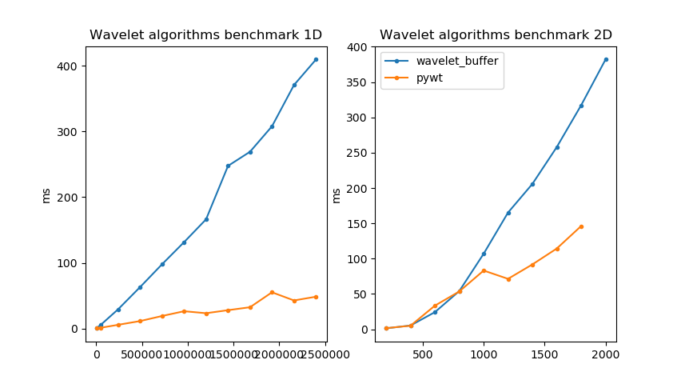

## Install conan
```bash
pipx conan install
```
## Build
```bash
mkdir build && cd build
conan install
cmake .. -DCMAKE_TOOLCHAIN_FILE=conan_toolchain.cmake -DCMAKE_BUILD_TYPE=Release
cmake --build .
```
## Run and draw benchmark
```bash
cd build
./benchmark -r xml::out=wb.xml
../pydwt.py
../plot.py wb.xml pywt.json
```

